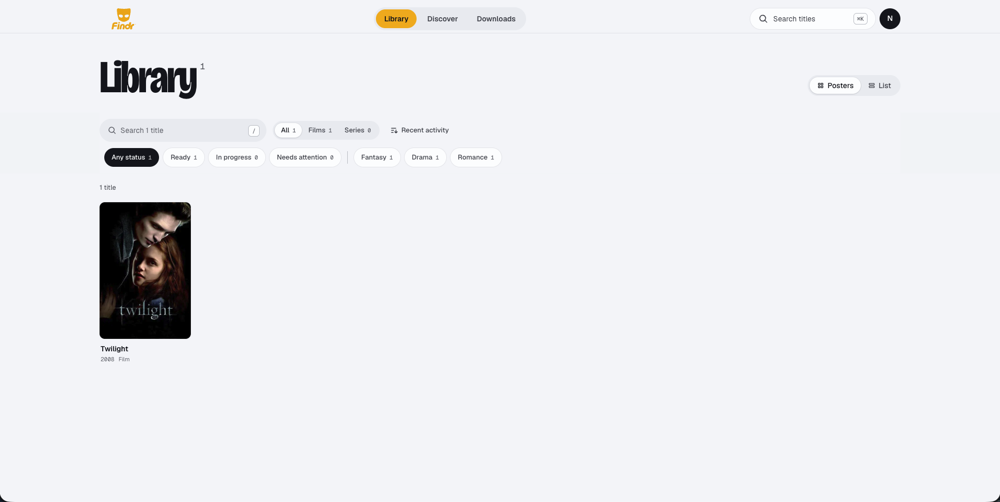
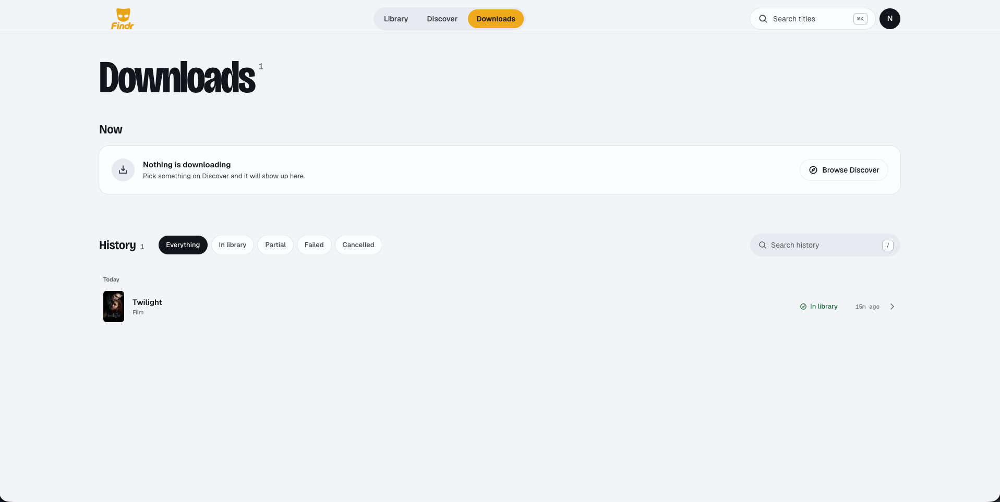
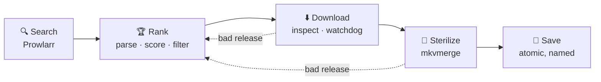

<div align="center">
  
  <h1>Find. Anything.</h1>
  <h4>A self-hosted downloader for movies and TV seasons, built for Jellyfin and Plex libraries.</h4>
</div>

## What is this?

Findr is a self-hosted web app that turns "I want this movie" or "I want season 2 of this show" into a clean file in your media library. It searches your indexers through Prowlarr, ranks every release it finds, downloads the best one through qBittorrent, strips it down to just its video and audio, and files it where Jellyfin or Plex expect it. When a release turns out to be bad — stalled, too slow, carrying an executable — Findr throws it away and tries the next one on its own.

> [!WARNING]
> Downloading copyrighted material without permission may be **illegal** where you live. Read the [disclaimer](#disclaimer) before using Findr.

<table>
  <tr>
    <td></td>
    <td></td>
  </tr>
  <tr>
    <td colspan="2" align="center"></td>
  </tr>
</table>

## Features

- 🔍 **Browse and request** — discover and search movies and shows (TMDB), then download a movie or a single season in one click.
- 🏆 **Release ranking** — parses every release title (resolution, codec, HDR, source, group, season/episode structure) and scores it on your preferences, size, seeders and more. Hard filters reject cams, wrong years, wrong seasons and oversized files outright.
- 🤖 **Wrong-title filter** *(optional)* — asks Claude to drop releases that are clearly a different film or show before anything downloads.
- 🛡️ **Inspected before downloaded** — the torrent's file list is checked before a single byte of payload arrives. Executables, scripts and archive-only releases are rejected; only the needed video files are fetched.
- ⏱️ **Watchdog** — abandons torrents that never resolve, stall, or crawl, and moves to the next release automatically.
- 🧼 **Sterilized output** — every file is remuxed with mkvmerge to video and audio only: no subtitles, attachments, chapters, tags or embedded titles survive.
- 📺 **Seasons done properly** — takes a complete season pack when one exists, otherwise fetches each aired episode on its own and reports exactly which ones made it.
- 💾 **Library-safe** — files land atomically under your naming templates, so your media server never sees a half-copied file.
- 🔁 **Resilient** — a persistent queue resumes after restarts and cleans up anything a crash left behind.
- 👥 **Private by default** — no public sign-up; admins create accounts. Rate-limited API.
- 📦 **One binary** — ships as a single executable with the web UI built in.

## How it works



1. **Search** — Prowlarr is queried by IMDb id (TVDB for shows), falling back to a text search. Duplicate listings of the same torrent collapse into one.
2. **Rank** — every release is parsed and scored. Releases failing a hard filter are kept with their rejection reason so you can see why they were skipped. If enabled, the best 20 are screened for wrong titles.
3. **Download** — the best candidate is added to qBittorrent so that it fetches only its file list. Findr inspects the list, rejects anything unsafe or incomplete, selects just the needed video files, and downloads them while the watchdog watches.
4. **Sterilize** — each file is remuxed to a fresh Matroska file with only video and audio tracks.
5. **Save** — the file is moved into your library under your naming templates, via a hidden temp file and an atomic rename.

If any step fails because of the release, it is rejected with the reason, its files and torrent are deleted, and the next candidate is tried — up to your attempt limit. For a season, Findr first tries whole-season packs (which must contain every aired episode), then falls back to one search per missing episode. Everything — candidates, scores, rejection reasons and every attempt — is visible on the **Downloads** page, where you can also hand-pick a release and retry.

## Requirements

| Dependency | Purpose |
|---|---|
| [Prowlarr](https://prowlarr.com/) | Searches your configured indexers |
| [qBittorrent](https://www.qbittorrent.org/) 4.5+ (5.x recommended) with the Web UI enabled | Downloads torrents. Must see the same file paths as Findr. |
| [MKVToolNix](https://mkvtoolnix.download/) (`mkvmerge`) | Sterilizes downloads |
| [TMDB API key](https://developer.themoviedb.org/) | Metadata, artwork, episode lists (free) |
| [Anthropic API key](https://console.anthropic.com/) *(optional)* | The wrong-title filter |
| [Bun](https://bun.sh) 1.3+ | Only needed to build from source |

Prowlarr and qBittorrent can run in Docker: [`docker/`](docker/README.md) has a Compose file for both (plus optional FlareSolverr) and a step-by-step setup guide.

## Installation

### From a binary

`bun run build` produces `dist/findr`, a single executable with the web UI embedded. It runs on the platform it was built on.

```bash
mkdir -p ~/findr && cp dist/findr ~/findr/ && cd ~/findr
cp /path/to/Findr/apps/api/.env.example .env   # then edit it
./findr
```

The binary reads `.env` from the directory you run it in and creates `findr.db` there unless `DATABASE_PATH` says otherwise.

### From source

```bash
git clone https://github.com/Benzo-Fury/Findr.git
cd Findr
bun install
cp apps/api/.env.example apps/api/.env   # then edit it
bun run build
bun run start
```

## Configuration

Deployment settings and secrets go in `.env`; everything else is edited in the app. The minimum `.env`:

```env
BASE_URL=http://localhost:3030
BETTER_AUTH_SECRET=<openssl rand -hex 32>
FINDR_ADMIN_EMAIL=you@example.com
FINDR_ADMIN_PASSWORD=<a strong password>
TMDB_API_KEY=<your TMDB key>
PROWLARR_URL=http://localhost:9696
PROWLARR_API_KEY=<your Prowlarr key>
QBT_URL=http://localhost:8080
QBT_USERNAME=<qBittorrent username>
QBT_PASSWORD=<qBittorrent password>
```

Then sign in as the admin, open **Settings**, and set the three library paths (downloads scratch space, movies, TV). Naming templates, release preferences, the queue, the download watchdog and the wrong-title filter are all on that page too.

Every variable and setting is documented in **[docs/Config.md](docs/Config.md)**.

### qBittorrent

In qBittorrent → Preferences → Web UI: enable the Web UI and set a username and password matching `QBT_USERNAME` / `QBT_PASSWORD`. Findr tags everything it adds with `findr` and removes its torrents when each attempt ends; it does not seed.

If qBittorrent runs in a container, mount the downloads folder at the same absolute path inside it as on the host, since Findr passes host paths. The [Docker setup](docker/README.md) does this for you.

## Usage

- **Discover** — browse trending and curated lists, or press <kbd>/</kbd> to search.
- Open a title and press **Download** (choose a season for shows). You are taken to its progress.
- **Downloads** — every download with live progress. Open one to see per-episode status, each attempt and why it ended, and every release considered with its score or rejection reason. Finished downloads can be retried, optionally with a release you pick.
- **Library** — everything requested, with the state of its latest download.
- **Settings** *(admins)* — everything tunable, plus account management.

## Building

```bash
bun run build
```

This builds the web app, generates the route and asset maps, and outputs:

| Output | What it is | Run with |
|---|---|---|
| `dist/index.js` + `dist/web/` | A single JS bundle and the web files it serves | `bun dist/index.js` |
| `dist/findr` | A standalone executable with the web UI embedded | `./dist/findr` |

The route map (`apps/api/scripts/cartographer.ts`) and asset map (`apps/api/scripts/assetmap.ts`) turn the routes folder and the built web app into static imports, which is what lets both outputs work without any files beside them.

## Development

```bash
bun install
bun run dev          # API on :3030 (hot reload) + Vite on :5173; open http://localhost:3030
```

Tests use Bun's test runner and an in-memory database; the sterilizer and end-to-end pipeline tests also need `mkvmerge` and `ffmpeg`:

```bash
cd apps/api && bun test
```

Type checking:

```bash
cd apps/api && bun run scripts/cartographer.ts && bun run scripts/assetmap.ts --allow-empty && bunx tsc --noEmit
cd apps/web && bunx tsc -b
```

## Project structure

```
apps/
  api/
    scripts/            build.ts, cartographer.ts (route map), assetmap.ts (web asset map)
    src/
      routes/           one file per endpoint; path = URL
      middleware/       auth, admin, validation, rate limiting
      lib/
        db/             SQLite client, migrations, models (all SQL lives here)
        pipeline/       queue, download runner, search, attempts, relevance filter
        downloader/     Downloader interface, qBittorrent, inspection, watchdog
        media/          Sterilizer (mkvmerge), LibrarySaver
        releases/       release title parser and scorer
        prowlarr/  tmdb/  auth/  env/  routing/  server/
  web/
    src/
      pages/            Library, Discover, Downloads, Settings
      components/       shared UI
      lib/              API client, hooks, formatting, status presentation
packages/
  types/                shared Zod schemas and types (@findr/types/*)
  config/               scoring weights (@findr/config/scoring)
docs/
  Config.md             every environment variable and setting
docker/                 Compose file and setup guide for Prowlarr, qBittorrent, FlareSolverr
```

## Attribution

[Roundup](https://github.com/0xlunar/roundup) by [0xlunar](https://github.com/0xlunar) — Findr was inspired by this project.

## Disclaimer

Findr is provided strictly for **educational and personal use**. The developers of Findr do not host, distribute, or index any copyrighted content. Findr is a tool that interacts with indexers you configure and the BitTorrent protocol. What you do with it is your responsibility.

Downloading copyrighted material without permission may be **illegal** in your country or jurisdiction. By using Findr, you acknowledge that:

- You are solely responsible for ensuring your use complies with all applicable local, state, and federal laws
- The developers assume no liability for any misuse of this software or any legal consequences that may arise from its use
- Findr was developed and tested exclusively using content uploaded by the developers themselves

**If you are unsure whether using Findr is legal where you live, do not use it.**

## License

_License to be decided._
